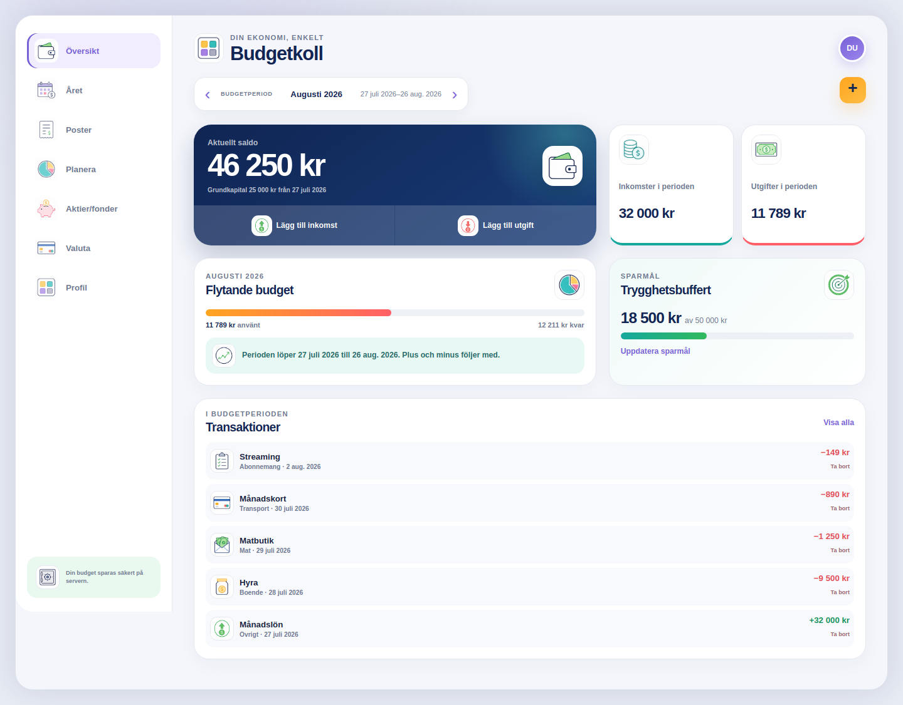

# Budget App by Åberg

Budget App är en självhostad webbapp för vardagsbudget, prognoser,
återkommande poster, sparmål och investeringsöversikt. Den publika
distributionen består av vanlig `index.html`, CSS, JavaScript, bilder och ett
litet PHP-API. Webbservern behöver inte ha Node.js, Vite eller Next.js.

Appen sparar budgetdata i MariaDB eller MySQL och kräver inloggning. Den
innehåller inga förinställda användare, ekonomiska uppgifter, API-nycklar,
databaslösenord eller domännamn.



*Budgetöversikten på dator. Alla belopp och poster i bilden är fiktiva
exempeldata.*

**Appen är skapad av: Hans Åberg.**

## Funktioner

### Budget

- inkomster och utgifter med datum, kategori, betalsätt och anteckning
- engångsposter och återkommande poster
- dagliga, veckovisa, månatliga och årliga intervall
- valfri brytdag för budgetperioden
- kategoribudget med överföring mellan perioder
- dubblettvarning för liknande poster
- sökning och filtrering
- grundkapital som följer med genom alla månader
- framåtblickande månadsöversikt till och med mars
- prognos per dag, vecka eller månad
- separat sparmål

Det löpande saldot beräknas enligt:

```text
saldo = grundkapital + inkomster − utgifter
```

Grundkapitalet läggs bara till en gång. Varje månads slutsaldo blir nästa
månads ingående saldo.

### Investeringar

Investeringsdelen är helt separerad från vardagsbudgeten och påverkar aldrig
budgetsaldot.

Följande innehavstyper stöds:

- aktier
- fonder
- krypto
- övriga innehav

Ett innehav kan bland annat innehålla namn, ISIN, ticker, antal, inköpskurs,
inköpsvärde, aktuell kurs, marknadsvärde, valuta, utdelning och anteckningar.
Avnoterade innehav kan ligga kvar och räknas med.

Appen har även:

- flera mäklar- och depåkonton
- import av Avanza-transaktioner från CSV
- manuell uppdatering av kurser
- publik, skrivskyddad instrumentsökning hos Avanza
- valfri Alpha Vantage-integration
- fondöversikt som kan klistras in och matchas efter fondnamn

Marknadsdata kan vara fördröjd och ska inte användas som orderunderlag.

### Övrigt

- valutaomräkning med referenskurser
- ljust och mörkt tema
- flera textstorlekar och typsnitt
- responsiv mobil-, surfplatte- och desktoplayout
- export och import av komplett JSON-säkerhetskopia
- versionskontroll som förhindrar att äldre data skriver över nyare data

## Så fungerar appen

Webbläsaren hämtar den statiska frontendkoden från webbservern. Frontendkoden
anropar PHP-filerna under `/api`. PHP hanterar inloggning, validering,
CSRF-skydd, databaslagring och externa marknadsförfrågningar.

Data delas upp i fyra dokument:

| Dokument | Innehåll |
| --- | --- |
| `budget` | Poster, återkommande serier, budgetar, grundkapital och sparmål |
| `investments` | Konton och innehav |
| `fund_snapshots` | Inklistrade fondvärden och utveckling |
| `appearance` | Tema, textstorlek och typsnitt |

Varje dokument har ett revisionsnummer. Vid sparande måste webbläsaren ange
den revision som senast lästes. Om dokumentet redan har ändrats på en annan
enhet svarar servern med konflikt i stället för att skriva över nyare data.

Alpha Vantage-nyckeln lagras krypterad med Sodium `secretbox`.
Krypteringsnyckeln ligger utanför webbplatsens katalog.

## Katalogstruktur

```text
Budget-App/
├── index.html
├── api/                    PHP-API
├── assets/
│   ├── app.js              Färdig frontend
│   ├── style.css
│   └── img/
├── apache/
│   └── budget-app.conf.example
├── config/
│   ├── config.php.example
│   └── auth.json.example
├── database/
│   └── schema.sql
└── tools/
    └── create-user.php
```

## Systemkrav

Exemplet nedan utgår från Ubuntu eller Debian med Apache.

- Apache 2.4
- PHP 8.2 eller senare
- PHP-tilläggen PDO MySQL, cURL, mbstring och Sodium
- MariaDB 10.6 eller senare, alternativt kompatibel MySQL
- HTTPS-certifikat
- ett eget domännamn eller subdomän

Appen är byggd för att ligga i domänens rot, exempelvis
`https://budget.example.com/`. Installation i en underkatalog stöds inte av
den färdiga distributionen.

## Installation på Ubuntu eller Debian

### 1. Installera paket

```bash
sudo apt update
sudo apt install apache2 mariadb-server php libapache2-mod-php \
  php-mysql php-curl php-mbstring certbot python3-certbot-apache git
sudo a2enmod headers ssl
```

Kontrollera att nödvändiga PHP-tillägg finns:

```bash
php -m | grep -E 'curl|mbstring|PDO|pdo_mysql|sodium'
```

### 2. Klona repot

Med SSH:

```bash
sudo git clone git@github.com:ProjektKhaos/Budget-App.git /var/www/budget-app
```

Eller med HTTPS:

```bash
sudo git clone https://github.com/ProjektKhaos/Budget-App.git /var/www/budget-app
```

Sätt läsrättigheter för webbservern:

```bash
sudo chown -R root:www-data /var/www/budget-app
sudo find /var/www/budget-app -type d -exec chmod 0755 {} +
sudo find /var/www/budget-app -type f -exec chmod 0644 {} +
```

### 3. Skapa databasen

Öppna MariaDB:

```bash
sudo mariadb
```

Skapa databas och en separat användare. Byt lösenordet:

```sql
CREATE DATABASE budget_app
  CHARACTER SET utf8mb4
  COLLATE utf8mb4_unicode_ci;

CREATE USER 'budget_app'@'localhost'
  IDENTIFIED BY 'BYT_TILL_ETT_STARKT_DATABASLÖSENORD';

GRANT SELECT, INSERT, UPDATE, DELETE
  ON budget_app.*
  TO 'budget_app'@'localhost';

FLUSH PRIVILEGES;
EXIT;
```

Läs in tabellerna:

```bash
sudo mariadb budget_app < /var/www/budget-app/database/schema.sql
```

Databasen innehåller:

- `documents` för appens fyra dokument
- `user_secrets` för krypterade externa API-nycklar
- `login_attempts` för begränsning av felaktiga inloggningsförsök

### 4. Skapa serverkonfiguration

Konfigurationen ska ligga utanför webbplatsens DocumentRoot:

```bash
sudo install -d -o root -g www-data -m 0750 /etc/budget-app
sudo install -o root -g www-data -m 0640 \
  /var/www/budget-app/config/config.php.example \
  /etc/budget-app/config.php
sudo nano /etc/budget-app/config.php
```

Ändra:

- `app_origin` till den fullständiga HTTPS-adressen
- databasnamn och databasanvändare om du valt andra namn
- `database_password` till lösenordet från föregående steg

`app_origin` måste stämma exakt, exempelvis:

```php
'app_origin' => 'https://budget.example.com',
```

### 5. Skapa inloggningskontot

Verktyget frågar efter lösenord utan att visa det. Minst 12 tecken krävs:

```bash
cd /var/www/budget-app
php tools/create-user.php owner "Budgetägare" \
  | sudo tee /etc/budget-app/auth.json >/dev/null
sudo chown root:www-data /etc/budget-app/auth.json
sudo chmod 0640 /etc/budget-app/auth.json
```

Användarnamn och visningsnamn kan bytas ut. Lösenordet lagras endast som en
säker hash.

Skapa därefter krypteringsnyckeln:

```bash
php -r 'echo sodium_bin2base64(
  random_bytes(SODIUM_CRYPTO_SECRETBOX_KEYBYTES),
  SODIUM_BASE64_VARIANT_ORIGINAL
), PHP_EOL;' | sudo tee /etc/budget-app/master.key >/dev/null

sudo chown root:www-data /etc/budget-app/master.key
sudo chmod 0640 /etc/budget-app/master.key
```

Förlora inte `master.key`. Sparade Alpha Vantage-nycklar kan inte dekrypteras
utan den.

### 6. Konfigurera Apache

Kopiera exempelkonfigurationen:

```bash
sudo cp /var/www/budget-app/apache/budget-app.conf.example \
  /etc/apache2/sites-available/budget-app.conf
sudo nano /etc/apache2/sites-available/budget-app.conf
```

Byt:

- `budget.example.com` till din domän
- `/var/www/budget-app` om du klonade till en annan plats

Aktivera sajten:

```bash
sudo a2ensite budget-app.conf
sudo apache2ctl configtest
sudo systemctl reload apache2
```

### 7. Aktivera HTTPS

```bash
sudo certbot --apache -d budget.example.com
```

Byt domänen i kommandot. Välj omdirigering från HTTP till HTTPS när Certbot
frågar. Appens sessionscookies kräver HTTPS.

Kontrollera sedan API:t:

```bash
curl https://budget.example.com/api/auth.php
```

Ett fungerande, utloggat svar ser ut så här:

```json
{"authenticated":false,"user":null,"csrfToken":null}
```

Öppna därefter webbplatsen och logga in med kontot du skapade.

## Första starten

Om kontot inte innehåller några dokument visar appen en startguide:

- befintlig lokal Budgetkoll-data kan flyttas till servern
- annars skapas en tom budget, tom investeringslista och standardutseende

Ingen exempeldataset eller personlig ekonomisk information följer med repot.

## Grundkapital och budgetperioder

Grundkapital är det belopp som finns tillgängligt vid ett angivet startdatum.
Alla registrerade inkomster och utgifter efter detta datum påverkar det
löpande saldot.

En valbar brytdag, 1–28, avgör vilken budgetperiod en post tillhör. Med
brytdag 27 löper exempelvis augustibudgeten från 27 juli till 26 augusti.
En enskild post kan tilldelas en annan budgetmånad utan att dess verkliga
datum ändras.

Vyn **Året** visar aktuell period och kommande perioder till och med mars.
Varje kort visar ingående saldo, inkomster, utgifter, månadsresultat,
slutsaldo, antal poster och de fem största posterna.

## Återkommande poster

En återkommande post innehåller startdatum, frekvens, intervall och valfritt
slutdatum. Fältet **Var N:e** bestämmer intervallet:

- månad och `1` betyder varje månad
- månad och `2` betyder varannan månad
- vecka och `3` betyder var tredje vecka

En förekomst kan ändras eller tas bort utan att resten av serien påverkas.
Det går även att ändra eller avsluta serien från ett visst datum.

## Investeringsdata och externa tjänster

Avanza-importen läser en CSV-fil lokalt i webbläsaren. Kontonumret sparas
inte. Innehav matchas i första hand med ISIN för att undvika dubbletter.

Den publika Avanza-sökningen används endast för skrivskyddad marknadsdata och
kräver ingen Avanza-inloggning. Tjänsten är extern och kan ändras eller sluta
fungera.

Alpha Vantage är valfritt. Lägg in nyckeln i appens investeringsvy efter
installation. Nyckeln krypteras innan den lagras i databasen och skickas inte
tillbaka till webbläsaren.

Valutakurser hämtas från en extern referenstjänst och kan skilja sig från
bankers och kortutgivares faktiska kurser och avgifter.

## Säkerhet

Installationen använder:

- lösenordshashning med PHP `password_hash`
- sessionscookies med `Secure`, `HttpOnly` och `SameSite=Strict`
- CSRF-token på alla skrivande API-anrop
- kontroll av anropets origin
- begränsning av felaktiga inloggningsförsök
- strikt servervalidering av JSON-data
- dokumentrevisioner mot oavsiktlig överskrivning
- Sodium-kryptering av externa API-nycklar
- hemligheter utanför webbplatsens DocumentRoot

Publicera aldrig följande filer i Git:

- `/etc/budget-app/config.php`
- `/etc/budget-app/auth.json`
- `/etc/budget-app/master.key`
- databasdump eller exporter med verkliga ekonomiska uppgifter

## Backup

Skapa en databasbackup:

```bash
sudo install -d -m 0700 /var/backups/budget-app
sudo mariadb-dump --single-transaction --quick --skip-lock-tables budget_app \
  | gzip -9 | sudo tee \
  /var/backups/budget-app/budget-app-$(date -u +%Y%m%dT%H%M%SZ).sql.gz \
  >/dev/null
```

Säkerhetskopiera även:

```text
/var/www/budget-app
/etc/budget-app/config.php
/etc/budget-app/auth.json
/etc/budget-app/master.key
/etc/apache2/sites-available/budget-app.conf
```

Förvara backupen krypterat och utanför den publika webbplatsen.

### Återställ databas

```bash
gunzip -c /sökväg/budget-app-DATUM.sql.gz \
  | sudo mariadb budget_app
```

Återställ därefter konfigurationsfilerna med ägare `root:www-data` och
rättighet `0640`.

## Uppdatering

Ta alltid backup först. Uppdatera sedan:

```bash
cd /var/www/budget-app
sudo git pull --ff-only
sudo chown -R root:www-data /var/www/budget-app
sudo find /var/www/budget-app -type d -exec chmod 0755 {} +
sudo find /var/www/budget-app -type f -exec chmod 0644 {} +
sudo apache2ctl configtest
sudo systemctl reload apache2
```

Läs releaseinformationen innan en uppdatering om databasschemat förändras.

## API

| Sökväg | Metoder | Funktion |
| --- | --- | --- |
| `/api/auth.php` | GET, POST | Sessionsstatus, inloggning och utloggning |
| `/api/state.php` | GET, PUT | Läsa och spara dokument |
| `/api/import.php` | POST | Importera en komplett backup |
| `/api/migrate.php` | POST | Första överföring från lokal data |
| `/api/secret.php` | PUT | Spara eller ta bort extern API-nyckel |
| `/api/alpha-market.php` | POST | Alpha Vantage-sökning och kurs |
| `/api/avanza-market.php` | POST | Publik Avanza-instrumentsökning |

API:t är avsett för appens frontend och kräver, förutom
inloggningsanropet, en giltig session. Skrivande anrop kräver CSRF-token.

## Felsökning

### `Serverlagringen är inte konfigurerad`

Kontrollera att `/etc/budget-app/config.php` finns och kan läsas av
webbserverns användare.

### `Databasen kan inte nås just nu`

Kontrollera DSN, databasnamn, användare och lösenord i `config.php`.

```bash
sudo systemctl status mariadb
sudo tail -n 100 /var/log/apache2/budget-app-error.log
```

### `Begäran kommer från fel webbplats`

Kontrollera att `app_origin` exakt matchar adressen i webbläsaren, inklusive
`https://` och eventuell subdomän.

### Inloggningen blockeras

Efter fem felaktiga försök från samma IP-adress blockeras nya försök i 15
minuter. Vänta eller, vid egen administration, töm aktuella poster:

```bash
sudo mariadb budget_app \
  -e 'DELETE FROM login_attempts;'
```

### PHP-fil laddas ned i stället för att köras

PHP-modulen är inte aktiv:

```bash
sudo a2enmod php8.2
sudo systemctl restart apache2
```

Versionsnumret kan skilja sig mellan distributioner.

## Avgränsningar

- Appen genomför inga banköverföringar eller värdepappersaffärer.
- Investeringar påverkar aldrig budgetsaldot.
- Sparmål ändrar inte saldot automatiskt.
- Marknads- och valutakurser kan vara fördröjda.
- Installationen är gjord för en ägare per instans.
- Appen är ett planeringsverktyg, inte finansiell rådgivning.
